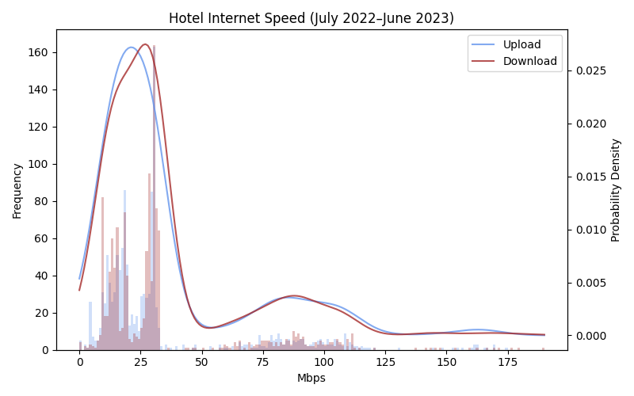

# Hotel Bandwidth

For the twelve months from the beginning of July 2022 through the end of June 2023, I recorded my internet download and upload speeds once per hour during every hotel stay.

The results were recorded to [results.csv](results.csv). I generated a chart showing histograms of up and down internet speed results, as well as probability density curves for the same results.

## Scripts

This repository contains several scripts for periodically recording and plotting hotel internet speeds.

### run_speedtest.py

Once per hour, runs an internet speedtest and saves the results in [results.csv](results.csv). It also calls the **plot_dist** function in [plot_dist.py](plot_dist.py) to update the bandwidth histogram and probability density chart.

### plot_dist.py

This script creates a histogram and probability density chart for the results in [results.csv](results.csv).
